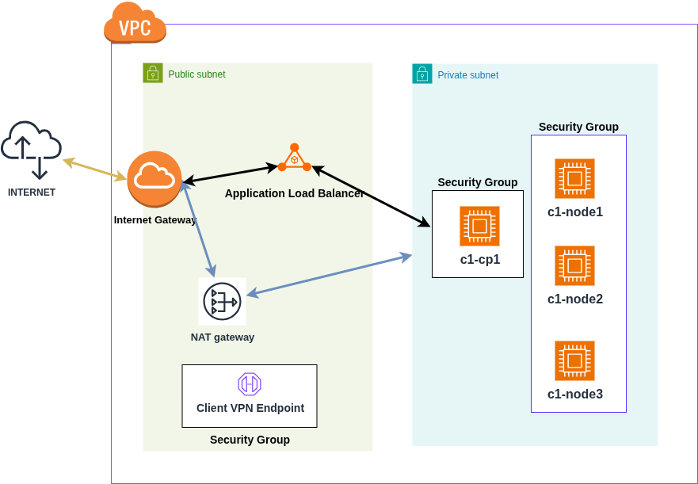

# Build out a Kubernetes Cluster in an AWS VPC with Client VPN Endpoint using Cloud Development Kit!

## To Do: (different branch)
##   - Register EC2 instances with EKS and manage the node in EKS!
##   - Use Spot Instances
##   - Use the Amazon EKS Optimized AMI instead of Ubuntu
##     aws ssm get-parameter --name /aws/service/eks/optimized-ami/1.31/amazon-linux-2023/x86_64/standard/recommended/image_id \
    --region us-east-2 --query "Parameter.Value" --output text
## ami-011b1a624adc9b86d
## Use Managed Node Groups

## Architecture



## Requirements

- AWS CDK installed
- AWS CLI installed
- Run `aws configure` to configure access keys
- AWS Session Manager installed
- openvpn installed

## Session Manager

```
$ curl "https://s3.amazonaws.com/session-manager-downloads/plugin/latest/ubuntu_64bit/session-manager-plugin.deb" -o "session-manager-plugin.deb"
$ sudo dpkg -i session-manager-plugin.deb
```

## VPN Access

Generate self signed certificates using easy-rsa, and import into AWS Certificate Manager

```
git clone https://github.com/OpenVPN/easy-rsa.git
./easyrsa build-ca nopass
cd easy-rsa/easyrsa3
./easyrsa --san=DNS:server build-server-full server nopass
./easyrsa build-client-full client.example.com nopass
aws acm import-certificate --certificate fileb://server/server.crt --private-key fileb://server/server.key --certificate-chain fileb://ca/ca.crt
aws acm import-certificate --certificate fileb://client/client.crt --private-key fileb://client/client.key --certificate-chain fileb://ca/ca.crt
```

Update lines 24,25 in the workspace_stack.py file with the correct Cert ARNs

After stack is created use openvpn to connect to the vpn client endpoint:

In the AWS UI go to VPC and to Client VPN Endpoint.  Click to download the configuration

Edit this configuration and add the following:

```
<cert>
! -- Paste in the `client.example.com` certificate created earlier
</cert>

<key>
! -- Paste in the `client.key` key created earlier
</key>
```

```
sudo openvpn --config config.ovpn &
ssh ubuntu@node -i key.pem
```


## AWS CDK Procedure

Create a virtualenv on MacOS and Linux:

```
$ python3 -m venv .venv
```

After the init process completes and the virtualenv is created, you can use the following
step to activate your virtualenv.

```
$ source .venv/bin/activate
```

Once the virtualenv is activated, you can install the required dependencies.

```
$ pip install -r requirements.txt
```

At this point you can now synthesize the CloudFormation template for this code.

```
$ cdk synth
```

Deploy the IaaC code with:

```
$ cdk deploy
```

After the infrastructure is built out run the Ansible Playbook to configure the cluster and install additional components such as Kubernetes Dashboard, ElasticSearch, Rancher, or ArgoCD CI/CD pipeline.

```
ansible-playbook automated_install.yml -i inventory -v
```

## Useful commands

 * `cdk ls`          list all stacks in the app
 * `cdk synth`       emits the synthesized CloudFormation template
 * `cdk deploy`      deploy this stack to your default AWS account/region
 * `cdk diff`        compare deployed stack with current state
 * `cdk docs`        open CDK documentation

Enjoy!
